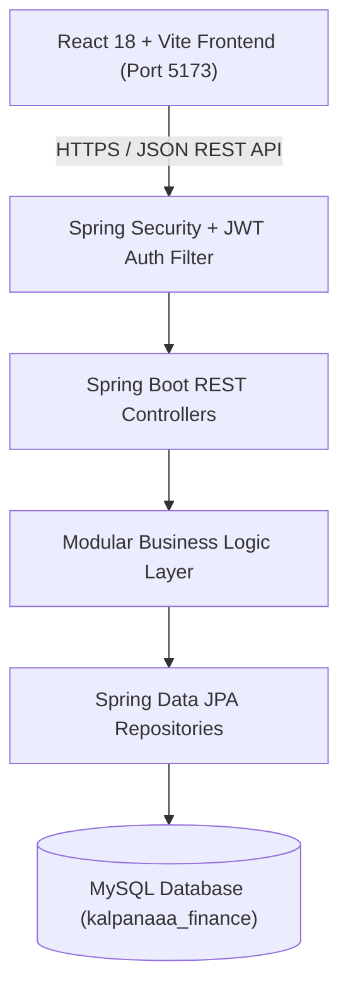

# Kalpanaaa Finance - Digital Wealth & Financial Advisory Platform 🚀

[](https://spring.io/projects/spring-boot)
[](https://react.dev/)
[](https://tailwindcss.com/)
[](https://www.oracle.com/java/)
[](https://www.mysql.com/)
[](LICENSE)

Empowering your financial future with smart investments, digital wealth solutions, automated loan management, and trusted financial advisory services.

---

## 📋 Table of Contents

- [Overview](#-overview)
- [Key Features](#-key-features)
- [Architecture & Tech Stack](#-architecture--tech-stack)
- [Project Structure](#-project-structure)
- [Prerequisites](#-prerequisites)
- [Getting Started](#-getting-started)
  - [1. Database Configuration](#1-database-configuration)
  - [2. Backend Setup (Spring Boot)](#2-backend-setup-spring-boot)
  - [3. Frontend Setup (React + Vite)](#3-frontend-setup-react--vite)
- [User Roles & Default Credentials](#-user-roles--default-credentials)
- [API Endpoints Overview](#-api-endpoints-overview)
- [Branding & Favicon Suite](#-branding--favicon-suite)
- [License](#-license)

---

## 🌟 Overview

**Kalpanaaa Finance** is a full-stack enterprise digital wealth and financial management platform designed to streamline personal wealth management, corporate financing, loan processing, investment planning, and expert advisory consultations. 

Built with a modern microservices-ready monolithic architecture, it offers dedicated role-based portals for **Customers**, **Financial Consultants**, and **System Administrators**.

---

## ✨ Key Features

### 🏦 Public Financial Portal
- **Corporate & Retail Advisory**: Comprehensive solutions for wealth growth, risk compliance, business financing, and lending.
- **Interactive Calculators**: Real-time Investment Return Estimator and EMI Loan Repayment Calculators.
- **Blog & Market Insights**: Live financial news categorized into Market Updates, Economy, Regulatory, and Corporate News.
- **Teal-Green Glassmorphic UI**: High-contrast, responsive design crafted with Tailwind CSS and backdrop blur glassmorphism.

### 👤 Customer Portal
- **Digital Wallet & Transactions**: Deposit funds, make instant withdrawals, and track transaction history.
- **Investment Management**: Subscribe to tailored investment plans (Fixed Returns, Equity Growth, High Yield).
- **Loan & EMI Tracker**: Apply for business/personal loans, view repayment schedules, and process EMI payments.
- **Financial Statements**: Download automated monthly and quarterly financial statement summaries.
- **Help Desk & Support**: Raise support tickets and chat directly with assigned financial consultants.

### 👨‍💼 Consultant Portal
- **Client Session Management**: View assigned customer consultation requests, schedule meetings, and update statuses.
- **Advisory Reports**: Prepare detailed financial health reports and portfolio recommendations for clients.

### 🛡️ Admin Portal
- **Platform Analytics**: Executive dashboard monitoring total system deposits, active loans, wallet balances, and user growth metrics.
- **User Management**: Granular control over Customer and Consultant accounts (Activation, Role Assignment, Audits).
- **Content Management**: Dynamic blog post creation, category management, and contact request handling.
- **System Audit Logs**: Real-time tracking of administrative actions and security events.

---

## 🏗️ Architecture & Tech Stack



### 💻 Frontend
- **Framework**: [React 18](https://react.dev/) + [Vite](https://vitejs.dev/)
- **Styling**: [Tailwind CSS](https://tailwindcss.com/) + Glassmorphism Backdrop Blur
- **Icons**: [Lucide React](https://lucide.dev/)
- **Charts & Data Viz**: [Recharts](https://recharts.org/)
- **Routing**: [React Router v6](https://reactrouter.com/)

### ⚡ Backend
- **Language**: [Java 21](https://www.oracle.com/java/)
- **Framework**: [Spring Boot 3.2.5](https://spring.io/projects/spring-boot)
- **Security**: Spring Security 6 + JWT (JSON Web Tokens)
- **Database Access**: Spring Data JPA / Hibernate ORM
- **Migrations**: Flyway DB Migration Framework
- **Build Tool**: Apache Maven

### 🗄️ Database
- **Engine**: MySQL 8.0+
- **Database Name**: `kalpanaaa_finance`

---

## 📁 Project Structure

```
kalpanaa-finance/
├── backend-java/                  # Spring Boot Java Backend
│   ├── src/main/java/com/kalpanaaafinance/
│   │   ├── config/                # Security, CORS, Flyway, App Configurations
│   │   └── modules/
│   │       ├── admin/             # Admin Controllers, Services, & DTOs
│   │       ├── consultant/        # Consultant Controllers & Services
│   │       ├── publicapi/         # Public Controllers (Blogs, Contact, Calculators)
│   │       ├── shared/            # Common Entities, Repositories, DTOs, Security
│   │       └── user/              # Customer Controllers, Wallet & Loan Services
│   ├── src/main/resources/
│   │   ├── db/migration/          # Flyway SQL Migration Scripts (V1 to V52)
│   │   └── application.properties # Spring Environment Configuration
│   └── pom.xml                    # Maven Dependencies & Configuration
│
└── frontend/                      # React + Vite Frontend
    ├── public/                    # Static Assets, Logotypes, & Multi-Res Favicons
    ├── src/
    │   ├── apps/
    │   │   ├── admin/             # Admin Dashboard Pages & Components
    │   │   ├── consultant/        # Consultant Portal Pages & Components
    │   │   ├── public/            # Public Landing Pages, Blogs, Calculators
    │   │   └── user/              # Customer Portal Pages & Wallet Management
    │   ├── shared/                # Navbar, Footer, Shared Layouts, API Interceptor
    │   └── App.jsx                # Application Routes & Auth Guard Context
    ├── package.json
    └── tailwind.config.js
```

---

## ⚙️ Prerequisites

Ensure you have the following installed on your machine:
- **Java Development Kit (JDK 21+)**
- **Node.js (v18.0.0 or higher)** & `npm`
- **MySQL Server (v8.0+)**
- **Git**

---

## 🚀 Getting Started

### 1. Database Configuration

Create the MySQL database:
```sql
CREATE DATABASE kalpanaaa_finance CHARACTER SET utf8mb4 COLLATE utf8mb4_unicode_ci;
```

Verify your MySQL connection credentials in `backend-java/src/main/resources/application.properties`:
```properties
spring.datasource.url=jdbc:mysql://localhost:3306/kalpanaaa_finance?useSSL=false&serverTimezone=UTC&allowPublicKeyRetrieval=true
spring.datasource.username=root
spring.datasource.password=YOUR_MYSQL_PASSWORD
```

---

### 2. Backend Setup (Spring Boot)

Navigate to the backend directory and run the Spring Boot application using Maven:

```bash
cd backend-java
./mvnw spring-boot:run
```

The backend server will start on **`http://localhost:8080`**.  
*Flyway will automatically execute all migration scripts and seed initial mock data.*

---

### 3. Frontend Setup (React + Vite)

In a new terminal window, navigate to the frontend directory:

```bash
cd frontend
npm install
npm run dev
```

The frontend application will start on **`http://localhost:5173`**.

---

## 🔑 User Roles & Default Credentials

| Role | Email | Password | Access Rights |
| :--- | :--- | :--- | :--- |
| **Admin** | `admin@kalpanaafinance.com` | `admin123` | Full system control, analytics, user management, audit logs |
| **Consultant** | `consultant@kalpanaafinance.com` | `consultant123` | Manage client consultations, schedule sessions, file reports |
| **Customer** | `john.doe@example.com` | `user123` | Wallet deposits/withdrawals, loan requests, investment plans |

---

## 📡 API Endpoints Overview

| Method | Endpoint | Description | Auth Required |
| :--- | :--- | :--- | :---: |
| `POST` | `/api/auth/login` | User authentication & JWT token issuance | ❌ |
| `POST` | `/api/auth/register` | Customer self-registration | ❌ |
| `GET` | `/api/public/blogs/{type}` | Fetch news/blogs by category | ❌ |
| `GET` | `/api/customer/wallet` | Fetch current customer wallet summary | `ROLE_USER` |
| `POST` | `/api/customer/wallet/deposit` | Process wallet deposit | `ROLE_USER` |
| `GET` | `/api/admin/dashboard` | Platform metrics & executive summary | `ROLE_ADMIN` |

---

## 🎨 Branding & Favicon Suite

- **Primary Brand Color**: Deep Emerald Green (`#051e17` / `#064e3b`)
- **Accent Color**: Metallic Gold (`#D4AF37`)
- **Favicon Badge**: Circular white badge with a metallic gold frame showcasing the 3D financial growth bar chart and gold upward arrow.

---

## 📄 License

Distributed under the MIT License. See `LICENSE` for more information.

---

<p align="center">
  Developed with ❤️ for <b>Kalpanaaa Finance</b>.
</p>
